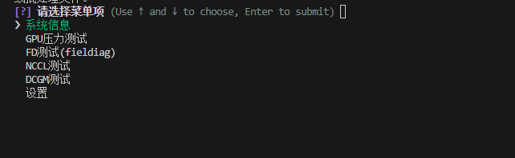

# text_gpu_tool
一个工具菜单

#如何使用

#1
安装依赖

"pip install noneprompt toml pyinstaller"

#2
dcgm自己安装
然后其他把测试工具放到固定目录就行了
/home/aisuan/gpu-burn
/home/aisuan/nccl
/home/aisuan/fd

#3打包 
pyinstaller main.spec

